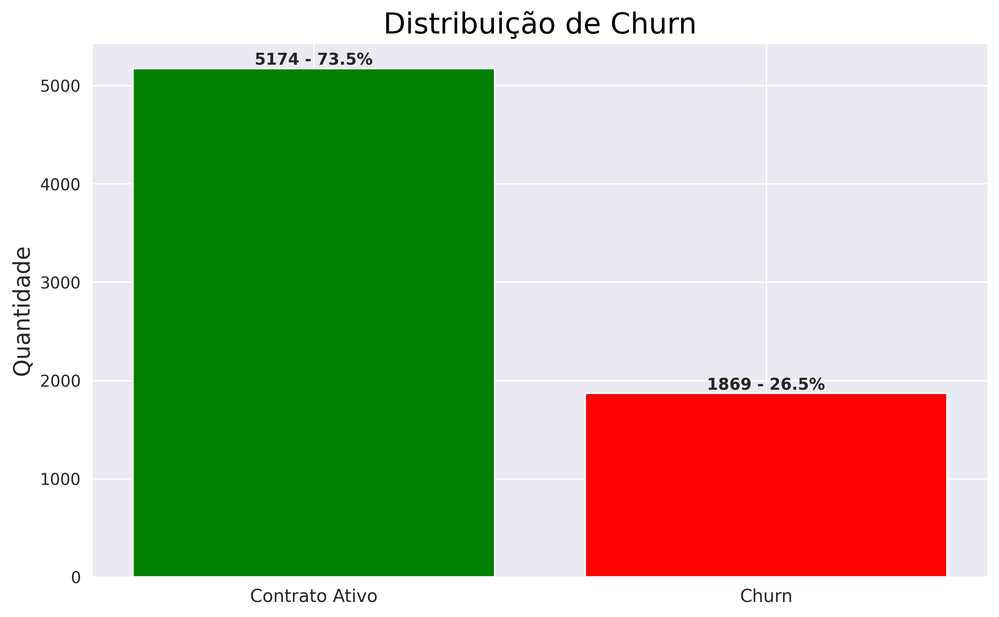
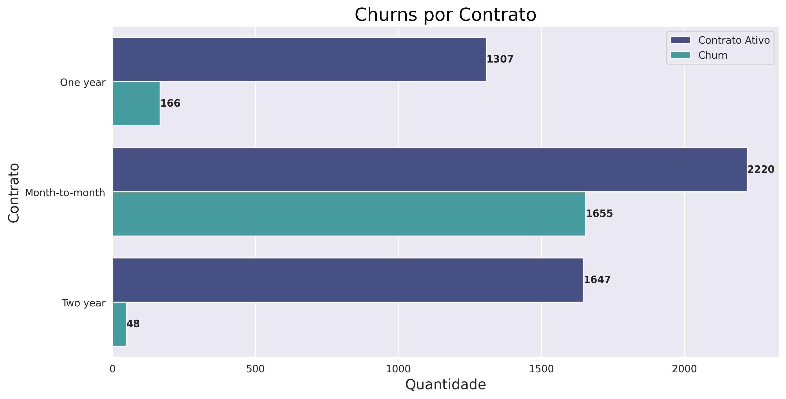
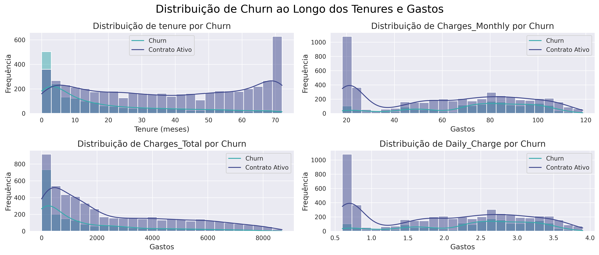
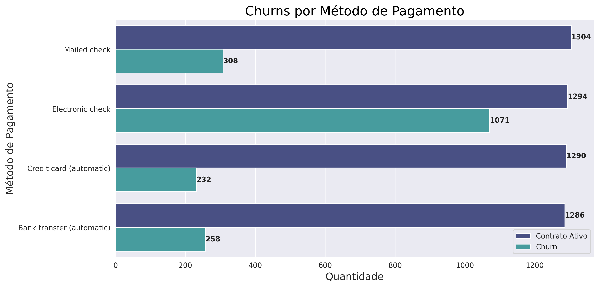
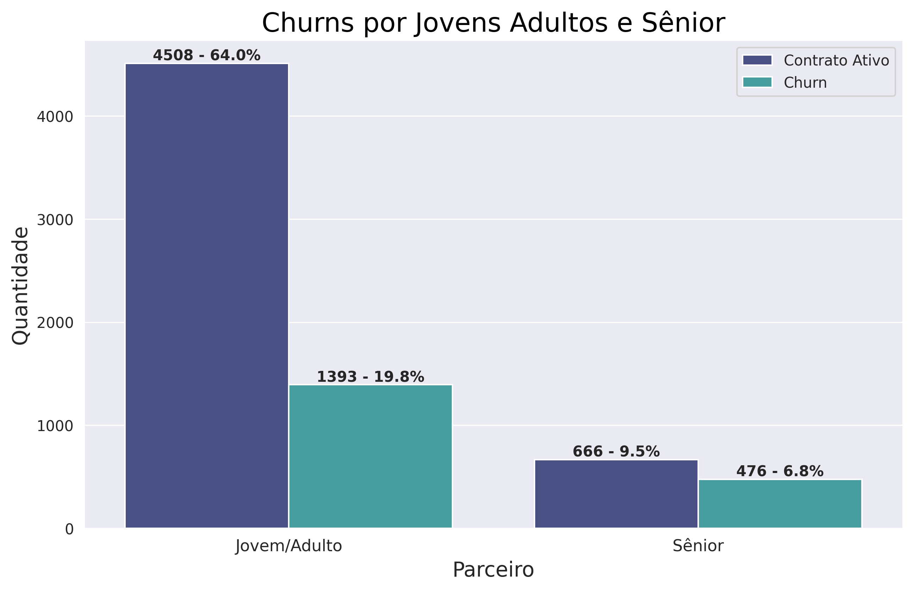
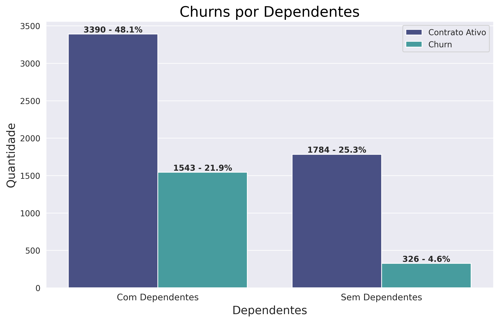
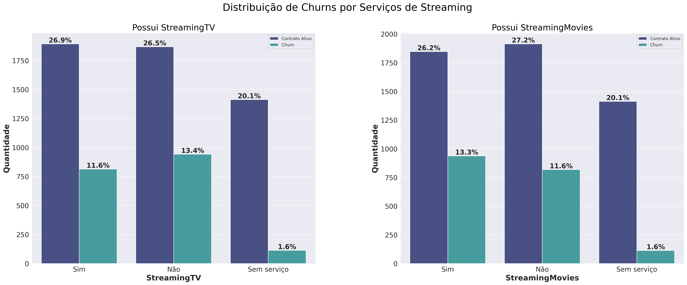

# 📊 Análise de Churn - TelecomX
---
Este projeto foi desenvolvido como parte do programa **Oracle Next Education (ONE)**, uma iniciativa educacional promovida pela **Oracle** em parceria com a **Alura**, tendo como objetivo analisar os dados de clientes da empresa TelecomX a fim de identificar os principais fatores que levam ao cancelamento de contrato (Churn) e propor recomendações para melhorar a retenção de clientes.

## 🧠 Objetivo

Investigar as causas do churn e gerar insights acionáveis com base em dados históricos dos clientes.

---

## 🔧 Metodologia

1. **Extração dos Dados**  
   - Dados importados de arquivo `.json`.

2. **Transformação**  
   - Normalização da estrutura em um DataFrame.
   - Conversão de colunas numéricas (ex: `TotalCharges`) para tipo adequado.
   - Tratamento de valores nulos e criação da coluna `Daily_Charge`.
   - Mapeamento binário de variáveis textuais (Yes/No → 1/0).

3. **Análise Exploratória**  
   - Visualizações com gráficos de barras, histograma, boxplot e heatmap.
   - Análise de churn por tempo de contrato, tipo de serviço, método de pagamento, etc.

---

## 📈 Resultados e Gráficos

### Distribuição geral do Churn
  
Mostra a proporção entre clientes que cancelaram (`Churn = Yes`) e os que permaneceram na base. Cerca de 26% dos clientes realizaram o cancelamento, o que levanta a necessidade de investigar os fatores associados.

---

### Churn por Tipo de Contrato
  
Clientes com contratos mensais apresentaram a maior taxa de cancelamento, enquanto contratos de 1 e 2 anos mostraram churn significativamente menor. Indicando que clientes tendem a cancelar com contratos mais curtos.

---

### Churn por Tenure e Gastos
  
Clientes com menos de 6 meses de contrato e altos gastos mensais estão entre os que mais cancelam. O custo percebido no início da jornada do cliente influencia fortemente o churn.

---

### Churn por Método de Pagamento
  
O método "Electronic check" é disparado o que mais apresenta churn, sugerindo desconforto ou desconfiança com esse tipo de pagamento. Outras formas como cartão de crédito apresentam taxas mais baixas.

---

### Churn por Faixa Etária (SeniorCitizen)
  
Clientes que não são classificados como “SeniorCitizen” (ou seja, adultos mais jovens) apresentaram maiores taxas de churn, o que pode indicar perfis mais voláteis ou menos comprometidos com fidelidade.

---

### Churn por Dependentes
  
Clientes sem dependentes demonstram maior propensão a cancelar. Isso pode estar relacionado a um uso mais individualizado dos serviços e menor engajamento.

---

### Churn por Serviços de Streaming
  
Clientes que não possuem serviços de streaming, como `StreamingTV` ou `StreamingMovies`, tendem a cancelar mais. A presença desses serviços pode aumentar a percepção de valor do pacote.

---

## 📌 Principais Fatores Identificados

| Fator                   | Descrição                                                      |
|-------------------------|----------------------------------------------------------------|
| Tenure < 6 meses        | risco de churn muito alto                                      |
| Contrato mensal         | 42,7% de churn vs. 11,1% (1 ano) e 2,9% (2 anos)               |
| Daily_Charge elevado    | custos diários altos → maior evasão                            |
| Electronic check        | método de pagamento com maior churn                            |
| Sem serviços adicionais | ausência de OnlineSecurity, TechSupport e OnlineBackup         |
| PaperlessBilling = 1    | churn levemente superior                                       |
| SeniorCitizen = 0       | jovens/adultos têm maior probabilidade de cancelar             |

---

## ✅ Recomendações

- Onboarding intensivo nos 6 primeiros meses.
- Incentivos para contratos de longo prazo.
- Pacotes de serviços essenciais com desconto.
- Melhoria e análise do método de pagamento `Electronic check`.
- Campanhas direcionadas para perfis com maior risco.

---

## 🛠️ Próximos Passos

- Implementar modelo preditivo de churn com base nas variáveis mais relevantes.
- Criar sistema de alertas para retenção proativa.
- Acompanhar a evolução da taxa de churn após ações aplicadas.

---
